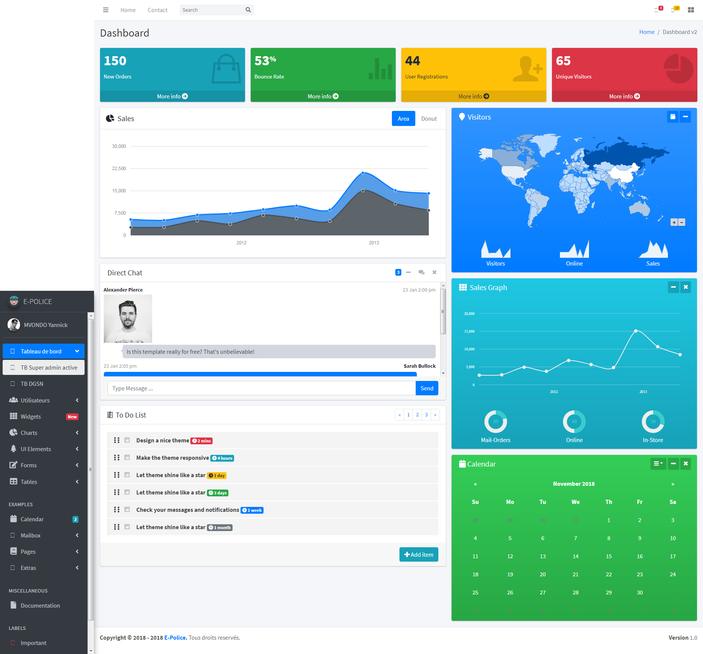
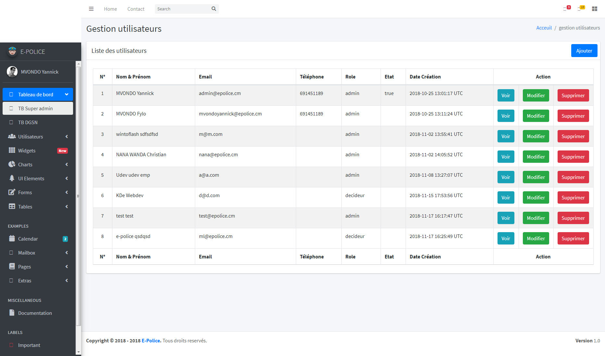

# E-POLICE API AND WEB PLATEFORM

Ceci est la plateforme de gestion E-POLICE 1.0.  

  

Elle propose les services suivants:  
1. **Backend**
    1. **Gestion de la configuration de base**
        1. Gestion du découpage administratif (région, département, arrondissement)
        2. Gestion des effectifs de police
        3. Gestion des types d'infractions
        4. Gestion 
    2. **Gestion des utilisateurs**
        1. Gestion des administrateurs
        2. Gestion des décideurs  
          
        
2. **API**
3. **Fonctionnalités**
    1. **Découpage administratif**
        1. Ajout, modification, suppression des regions
        2. Ajout, modification, suppresion des départements
        3. Ajout, modification, suppression des arrondissements
    2. **Poste de police**
        1. Ajout, suppresion, modification des postes de police
        2. Affectation dun poste de police à un découpage administratif

oThis README would normally document whatever steps are necessary to get the
application up and running.

Things you may want to cover:

* Ruby version deploy for this plateform is

* System dependencies

* Configuration

* Database creation

* Database initialization

* How to run the test suite

* Services (job queues, cache servers, search engines, etc.)

* Deployment instructions

* ...

* 
